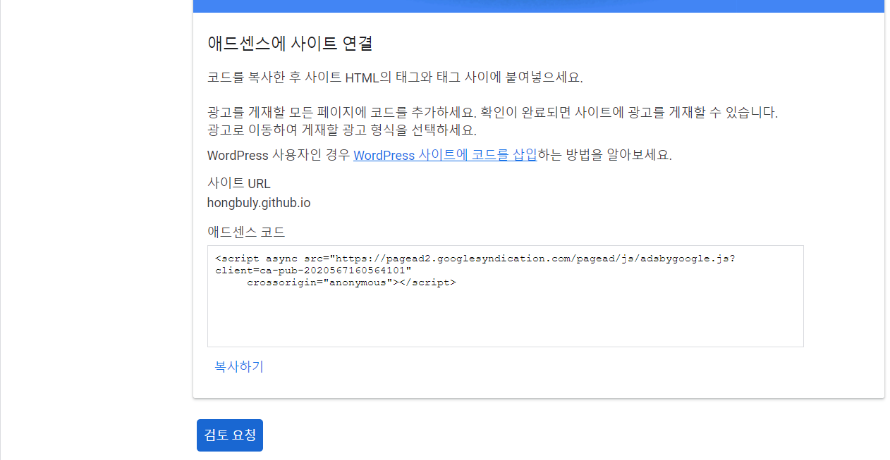

### 소프트웨어학부 20213032 윤홍현

## git에 저장소 만들기
#### Github 사이트에 들어가서 왼쪽 상단 new 버튼을 눌러 새로운 저장소를 만든다.

#### Repository 이름을 `<username>.github.io` 로 하고 Public으로 생성한다.   
###### 지금 사진은 이미 만들어져 있어서 그렇다. 처음 만들면 정상적으로 생성할 수 있다.

#### git을 설치하고 HTTPS 형식으로 git clone을 한다. [Git 설치 링크](https://git-scm.com/downloads)
###### Github Desktop을 설치하면 GUI로 git을 관리할 수 있어 CLI보다 친근하다.

#### 원하는 디렉터리로 이동하고 git bash를 실행시킨다. 그리고 명령어로 git clone <HTTPS 주소> 라고 적는다.

    $ git clone https://github.com/hongbuly/hongbuly.github.io.git

#### 이제 git <명령어>를 통해서 git을 관리할 수 있다.

#### 처음에 git push를 통해 원격저장소에 반영하려면 토큰을 통해 로그인해야 한다.
#### Settring -> Developer settings -> Personal access tokens -> Generate new token

#### 이제 PAT 번호를 통해 로그인하면 된다.
#### 페이지 설정 확인을 하는 방법은 다음과 같다.
#### Repository Settings -> Pages

## 이미 만들어진 Lanyon 테마 웹사이트에서 시작하기
1. Lanyon 테마의 원격 저장소 내용을 다운받는다.   
[Lanyon 원격 저장소 링크](https://github.com/poole/lanyon)
2. hongbuly.github.io 라는 로컬 저장소에 해당 내용을 넣는다.
3. 다음과 같은 명령어로 원격 저장소에도 해당 내용을 올린다.

    $ git add *
     
    $ git commit -m "Initial setup"
     
    $ git push

## _config.yml 파일 수정하기
#### 탬플릿의 dummy 정보가 아닌 나의 웹사이트 정보로 교체하는 일이 필요하다.  
#### 가장 중요한 것은 url에 나의 웹주소를 적고, baseurl을 주석처리를 해야 주소창에 url을 적었을 때 결과가 잘 나온다.
<pre>
<code>
# Setup
title:               Hongbuly # 페이지 상단에 뜨는 이름
tagline:             'Hongbuly blog' # title 옆에 뜨는 이름
description:         'A reserved <a href="https://jekyllrb.com" target="_blank">Jekyll</a> theme. This blog made by hongbuly.'  # 사이드바 설명
url:                 https://hongbuly.github.io # 웹주소
# baseurl:             ''
paginate:            5
permalink:           pretty
comments:            true # 댓글 허용

# About/contact
author:
  name:              Honghyun Youn
  url:               https://hongbuly.github.io
  email:             hongbulys@gmail.com

# Gems
plugins:
  - jekyll-paginate

# Custom vars 댓글 기능
version:             1.1.0
google_analytics_id: #UA-XXXX-Y
comment:
  provider: "disqus"
  disqus:
    shortname: "hongbuly"
</code>
</pre>

## 웹페이지 대표 이미지(favicon) 변경하기
#### public 디렉토리 안에 favicon.ico 파일을 변경하면 된다.
[ico 파일 변환 사이트](https://convertio.co/kr/png-ico/)

#### hongbuly.github.io 사이트는 키위새 사진이다.

## sidebar.html 파일 수정하기
#### 왼쪽 사이드바에 Download, Github project가 있는데 불필요해서 다음과 같은 코드를 주석처리 해주었다.

    <a class="sidebar-nav-item" href="{{ site.github.repo }}/archive/v{{ site.version }}.zip">Download</a>
    <a class="sidebar-nav-item" href="{{ site.github.repo }}">GitHub project</a>

## _posts 디렉토리에 post 글 추가하기
#### 글을 쓰고 싶을 때, _posts 디렉토리에 "년도-월-일-이름.md"로 파일을 생성해서 작성해야 한다.
##### "-"를 빼먹거나 형식이 틀리지 않게 주의해야 한다.

    2021-11-25-Git&Github.md

#### 파일 상단에 다음과 같은 내용을 쓴 다음 글을 써야 한다.
<pre>
<code>
---
layout: post
title: Git&Github # 글 제목
date: 2021-11-25 16:30:59 +0900 # 날짜와 시간
categories: jekyll update
comments: true # 댓글 허용
---
</code>
</pre>

## 댓글 기능 추가하기
#### post 글에 Disqus를 이용해 간단히 추가할 수 있다.
- 먼저 회원가입을 한다.

- 로그인 후 GET STARTED 버튼을 누른다.

- 여기서 웹사이트 이름을 잘 기억해 두어야 한다.
##### 이미 존재하는 이름을 사용하면 뒤에 "-숫자"가 더 붙는다.

- platform으로 jekyll을 선택한다.

- post 글 처음에 어떻게 써야 하는지 알려준다.
##### 위에 포스트 글 쓰는 방법에서 언급된 부분이다. 

- github.io 웹사이트 주소를 적는다.

- 마무리 버튼까지 누른다. 

#### 이제 _config.yml 파일에 다음과 같은 코드를 추가한다.
##### 전체 코드는 앞서 소개되었다.

    # Custom vars 댓글 기능
    version:             1.1.0
    google_analytics_id: #UA-XXXX-Y
    comment:
      provider: "disqus"
      disqus:
        shortname: "hongbuly"

#### _layouts 디렉터리에 post.html 파일에도 다음과 같은 코드를 추가한다.
##### s.src 부분에 내 이름이 포함되어서 수정됬는지 확인이 필요하다.

    
    <h2>Comments</h2>
    

    
    <noscript>Please enable JavaScript to view the <a href="https://disqus.com/?ref_noscript">comments powered by Disqus.</a></noscript>
    

#### 다음과 같은 결과가 나온다.

## Google Adsense 활용하기
[Google_Ad 링크](https://www.google.com/intl/ko_kr/adsense/start/)

#### 위 사이트에서 시작하기를 눌러 홈페이지 url을 적는다.
#### 그 다음 단계에 따라 결제 프로필을 작성해야 한다.

#### 에드센스에 사이트 연결하는 단계를 따라가 코드를 복사하여 head.html 파일 안에 붙여넣기 한다.

    <head>
    
     .
     .
     .
     </head>

#### 사이트의 광고 개재 가능 여부를 검투하는데 며칠 걸린다.
#### 다만, 본 사이트의 경우 컨텐츠 부족으로 구글 Adsense 정책에 부합하여 광고 개재를 거부당했다.