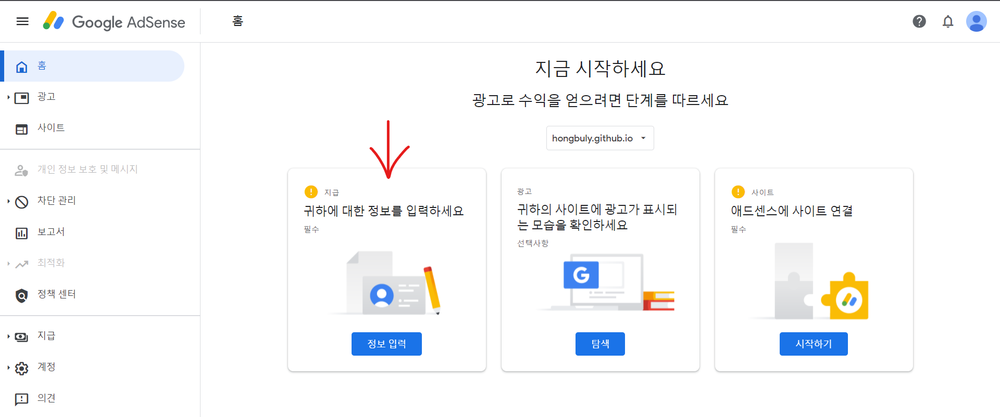

## Google_Adsense란?
#### 웹사이트에 광고를 삽입하여 수익을 창출시킬 수 있는 서비스입니다.
[Google_Ad 링크](https://www.google.com/intl/ko_kr/adsense/start/)

#### 위 사이트에서 시작하기를 눌러 홈페이지 url을 적습니다.

#### 그 다음 결제 프로필을 작성해야 합니다.

#### 여기서 `data-ad-client` 부분에 명시된 ca-pub로 시작되는 값이 본인의 광고 id입니다.

